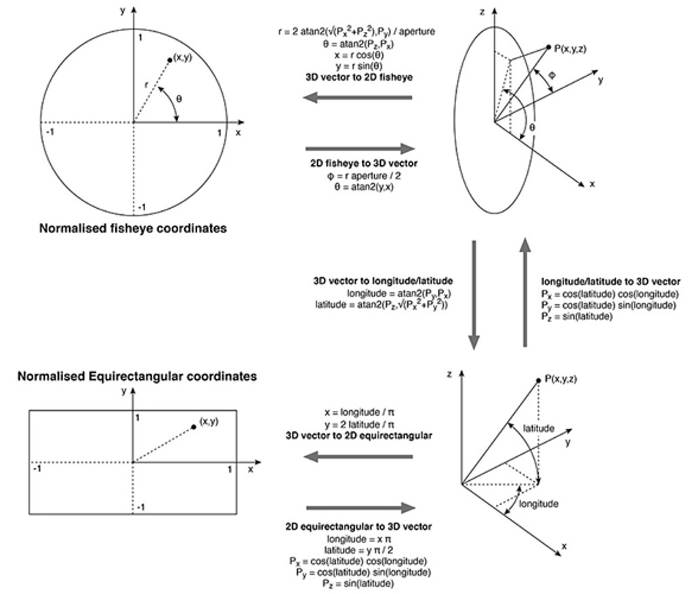
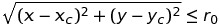

# py-fisheye-dewarp

## requirement
- numpy
- scipy

## description
convert fisheye image to dewarpped image

## Theory

0. constants  
x_c, y_c = center of lens  
r_0 = radius of lens  

image coordinate sys.  
  

1. fisheye coordinate(uv) → spherical coordinate(xyz)
fisheye circle(uv) is moved to xz plane in spherical.  

**inside the fisheye circle**  
 ← IF condition

2. spherical(xyz) → logitude/latitude
- longitude = [0, 2π]  
(However, **atan2** function don't return over π, just return [-π, π])
- latitude = [-π/2, +π/2]

**ex) single 180º fisheye**
- longitutde = [0, π]
- latitude = [-π/2, +π/2]

**ex) single 190º fisheye**
- longitutde = [-5º, 185º]
- latitude = [-π/2, +π/2]

### longitude/latitude shift to fit array index

## Codes
### single_fisheye.py
dewarp one single fisheye image.

### sinlge_fisheye_downsample.py
dewarp one single fisheye image with down-sampling.
