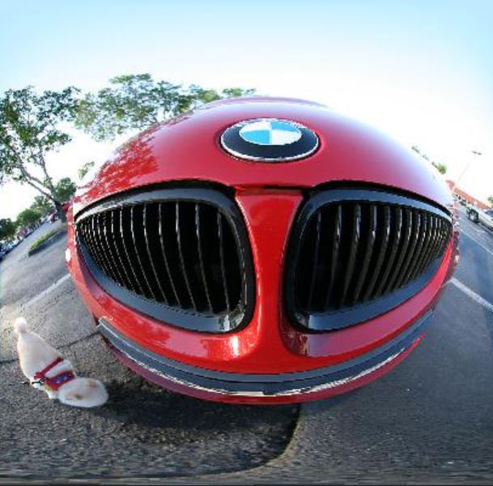
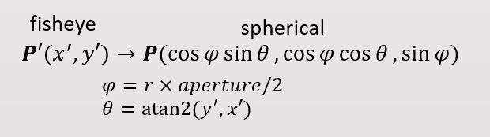
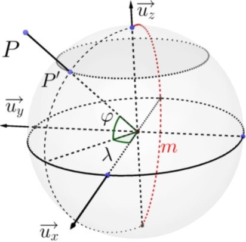
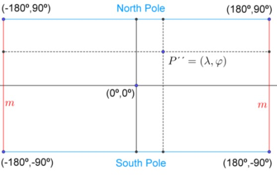
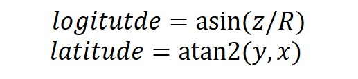
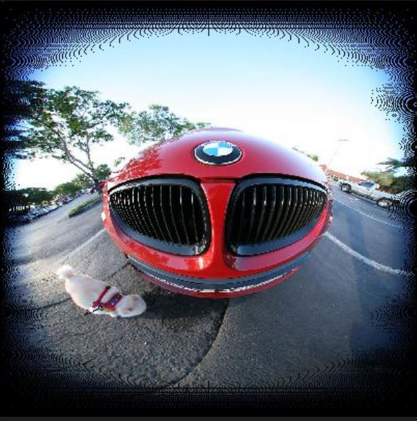

(Index)
# Dewarp Fisheye Image.

## Fisheye Image has Distortion
 

Fisheye Image always has some distortions and it is severe in the circular edge region. 

The original fisheye image is circular shape but, we want to dewarp it into rectangular and blend two fisheye images to equirectangular.

The goal of this document is understand how to convert fisheye image to dewarpped image.

 

cf) dewarpped fisheye image  has **Barrel distortion**.

## Fisheye Image dewarp
When dewarp the fisheye image, we use three coordinate system.
- **fisheye image** - (u, v) or (x', y')
- **spherecial** - (x, y, z)
- **longitude/latitude** - (x'', y'')

There are two way to generate dewarpped fisheye image.  
(1) fisheye → spherical → longitude/latitude  
(2) longitude/latidue → spherical → fisheye

(Let's think in the unit coordinate system first, and later we'll adjust it to the practical use.)

## fisheye → spherical → longitude/latitude

### fisheye(uv) → spherical(xyz)
fisheye image is a kind of sphere's projection image. So, from fisheye image we can imagine a sphere which has fisheye image as a surface.

### spherical(xyz) → longitude/latitude
 
In this time, transfer the pixel in the spehre to longitude/latitude coordinate, like world map.

 

 

But, if you construct your code in this way, there's must be some **black dot areas** that cannot fullly match to fisheye image to longitude/latitude map.  

Because, **it's impossible to make a squre which has equal-area with a circle.** (cf. it is also applied in discret world)

## longitude/latitude → spherical → fisheye

## Lens Infromation

## references
- [Wiki - Image Distortion](https://en.wikipedia.org/wiki/Distortion_(optics))  
- [A Practical Distortion Correcting Method from Fisheye
Image to Perspective Projection Image](https://www.semanticscholar.org/paper/A-practical-distortion-correcting-method-from-image-Wang-Liang/3dff7f526f6910e6b104f72f404ef0ebd88bcd7f)  
- [paulbourke](http://paulbourke.net/dome/fish2/)
- [Drawing Equirectangular VR Panoramas with Ruler, Compass, and Protractor](https://www.researchgate.net/publication/324314917_Drawing_Equirectangular_VR_Panoramas_with_Ruler_Compass_and_Protractor)
