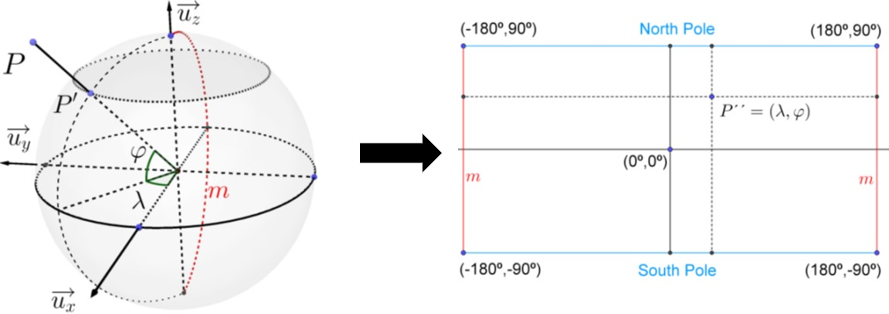
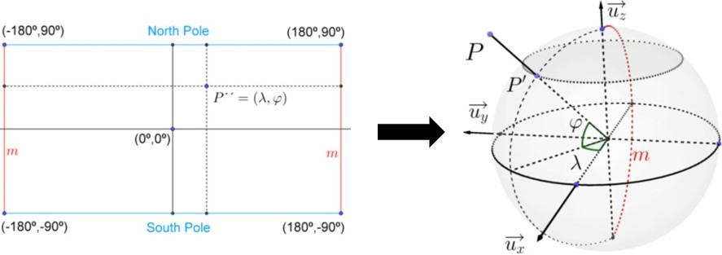
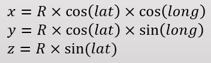
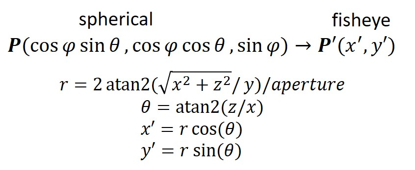

# Dewarp Fisheye Image.
[영문판(ENG)]()

## Fisheye Image has Distortion
 

**Fisheye Image**는 그것의 가장자리에 늘 **왜곡(Distortion)**을 가지고 있습니다.  
그리고 우리는 앞/뒤의 두 Fisheye 이미지를 각각 활용할 것이 아닌, **두 Fisheye 이미지를 통합적으로 사용할 것**이기 때문에, 두 Fisheye Image를 펼쳐서(dewarp), 적절히 합쳐(blend) Equirectangular 이미지로 만들고자 합니다.  

*본 문서는 Fisheye 이미지를 펼쳐진(dewarpped) 이미지로 변환하는 방법을 정리한 것입니다.*

 

(참고) 펼쳐진(dewarpped) 이미지는 **Barrel distortion**을 갖게 된다.

## Fisheye Image dewarp
Fisheye 이미지를 펼치기 위해선 3개의 좌표계가 사용됩니다.
- **fisheye image** - (u, v) or (x', y')
- **spherecial** - (x, y, z)
- **longitude/latitude** - (x'', y'')

그리고 펼처진 Fisheye 이미지를 만드는 방법에는 2가지가 있는데, 
(1) fisheye → spherical → longitude/latitude  
(2) longitude/latitude → spherical → fisheye

(우리는 unit 좌표계에서 먼저 이 과정을 다룬 후, 실제 radius를 반영한 좌표계에 적용하도록 하겠습니다.)

## fisheye → spherical → longitude/latitude

### fisheye(uv) → spherical(xyz)
fisheye 이미지는 구(sphere)의 표면을 사영하여 이미지입니다. 그렇기에 우리는 fisheye 이미지를 바탕으로 fisheye 이미지를 표면으로 하는 원래의 구를 재구성할 수 있습니다.

   

fisheye 이미지에서 spherical 좌표계로 변환하는 방법은 아래와 같습니다.  

 

### spherical(xyz) → longitude/latitude(x''y'')
 
(세계지도는 longitude/latitude coordinate의 대표적인 예이다.)  

이번에는 구의 표면을 이루는 각 픽셀을 longitude/latitude coordinate로 변환해봅시다.

 

하지만 이런 방식으로 코드를 짜게 되면, 결과 이미지에 원본 fisheye 이미지로부터 픽셀 값을 받지 못한 **검은 패턴**이 나타나게 될 것이다.

이런 현상이 발생하는 이유는, **원과 동일한 넓이는 가진 정사각형을 만드는 것이 기하학적으로 불가능**하기 때문이다. (이 원리는 이산적인 공간에서도 동일하게 적용된다.)  

이런 문제점을 해결하기 위해, 이번에는 역방향으로 펼처진 fisheye 이미지를 구성해보자.  

## longitude/latitude → spherical → fisheye

### longitude/latitdue(x''y'') → spherical(xyz)
 
 
(우리가 unit 좌표계를 보고 있다면, 구의 반지름 **R**은 1이 된다.)

### spherical(xyz) → fisheye(uv)
 
(화각(aperture) 단위는 radian이어야 하는데, 그 이뉴는 `atan2` 함수가 radian 값을 반환하기 때문이다.)

위와 같은 역방향으로 longitude, latitude 배열에 fisheye 이미지의 픽셀을 대응시킨다면, 아래와 같은 깔끔하게 펼쳐진 fisheye 이미지를 얻을 수 있다.

## Lens Information
fisheye 이미지를 가공하기 전에 미리 알아야 하는 정보가 있다.   
- 렌즈의 중심(Center of Lens)
- fisheye 이미지 반지름(Radius)
- 렌즈의 화각(Aperture)

## references
- [Wiki - Image Distortion](https://en.wikipedia.org/wiki/Distortion_(optics))  
- [A Practical Distortion Correcting Method from Fisheye
Image to Perspective Projection Image](https://www.semanticscholar.org/paper/A-practical-distortion-correcting-method-from-image-Wang-Liang/3dff7f526f6910e6b104f72f404ef0ebd88bcd7f)  
- [paulbourke](http://paulbourke.net/dome/fish2/)
- [Drawing Equirectangular VR Panoramas with Ruler, Compass, and Protractor](https://www.researchgate.net/publication/324314917_Drawing_Equirectangular_VR_Panoramas_with_Ruler_Compass_and_Protractor)
